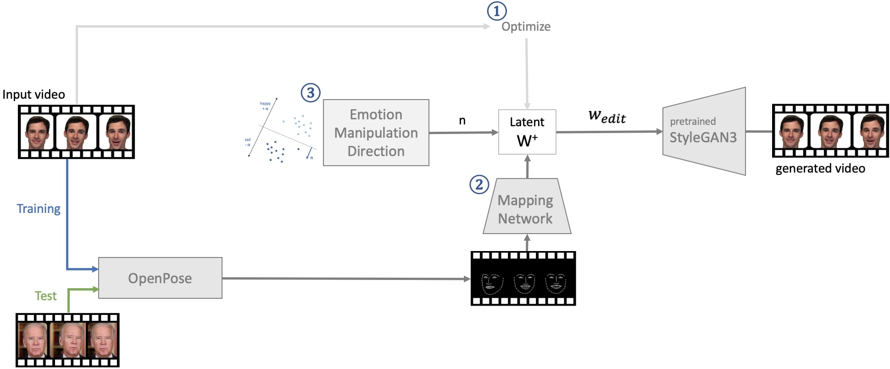
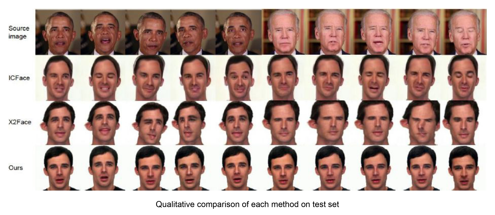
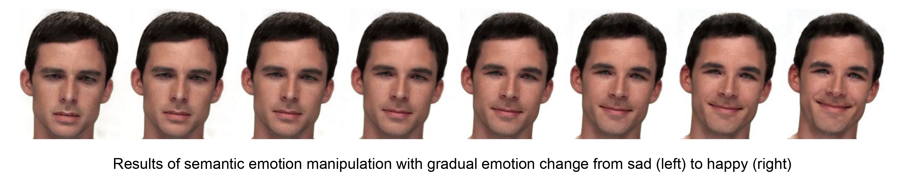

# Facial Reenactment from Sparse Landmarks using StyleGAN3

<p align="center"></p>

## Introduction
In this work, we propose a new method of facial reenactment which enables to transfer the source 
face movement by simply tracking sparse facial landmarks.  We adopt OpenPose to extract the facial 
landmarks of each frame of the source video and optimize the latent space of pretrained StyleGAN3 of the target actor
to learn our mapping network. By training the network which maps from the facial landmarks to the corresponding 
latent vector, we are able to transfer the facial expression from the source to the target actor by 
simply feeding its facial landmarks.

## Setup
Please check the StyleGAN3 website [here](https://github.com/NVlabs/stylegan3) for setup.

## Usage
### Optimization
To optimize latent vectors in StyleGAN3 space of the target actor:
```shell
python embedding.py --epochs 30
python optimize.py
```

### Training
To train the mapping network:
```shell
python basis.py --epochs 30
```
To train the SVM classifier for finding latent manipulation directions:
```shell
python edit_direction.py
```

### Evaluation
To evaluate the trained model:
```shell
python test.py
```
To visualize the semantically edited latents:
```shell
python visualize.py
```
To calculate landmark difference for quantitative results for face reenactment:
```shell
python compare_lmk.py
```
To calculate LPIPS and FID for quantitative results for emotion manipulation:
```shell
python compare_LPIPS_FID.py
```

<p align="center"></p>
<p align="center"></p>
